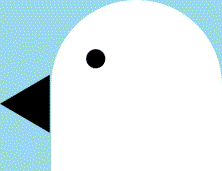

    

  

  <h1>
 This project name is grouse.
</h1>
  <h3>
<ins> Use nyasocom_sun_pg_win. </ins>
</h3>
  <h4>
 Please readme, See the <a href="https://github.com/takkii/grouse/wiki/manual">wiki</a> for how to use. 
</h4>

